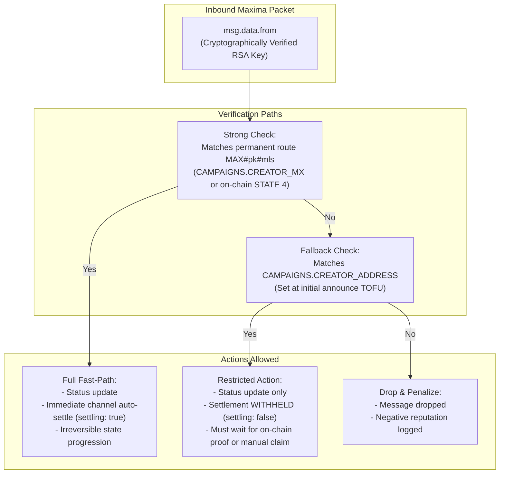

# MinimaAds: Attack Surface & Trust Boundaries Specification

> **Document Status**: Living Architectural & Security Baseline  
> **Target Audience**: Security Auditors, Core Contributors, Node Operators  
> **Last Updated**: September 2026  
> **Scope**: MinimaAds MiniDapp (Rhino Service Worker, Maxima Messaging, KissVM Contracts, and Frontend Bridge)

---

## 1. Executive Summary & Threat Model

MinimaAds operates in a decentralized, untrusted peer-to-peer environment across three independent layers:
1. **The Transport Layer (Maxima)**: End-to-end encrypted, RSA-signed asynchronous messaging between Minima nodes.
2. **The Consensus Layer (Minima L1 / KissVM)**: UTXO-based state machine enforcing financial contracts (Escrow and 2-of-2 Payment Channels).
3. **The Local Execution Layer (Rhino JS Service Worker & Browser DOM)**: Background state synchronization, database persistence (H2/SQL via MDS), and user interface.

### Threat Actors
* **Malicious Peer / Sybil Node**: Any arbitrary Minima node on the network capable of sending well-formed Maxima packets with valid RSA transport signatures.
* **Malicious Viewer / SDK Integrator**: An entity attempting to claim unearned payouts, forge inflated cumulative counters, replay expired vouchers, or exhaust campaign budgets.
* **Malicious Publisher**: An entity attempting to impersonate ad frames (`frame_id`), redirect advertiser payout channels, or claim rewards for unserved impressions.
* **Malicious Creator**: An advertiser attempting to withhold signed settlement vouchers, repudiate active payment channels, or prematurely reclaim locked escrow funds.
* **Network Attacker / MLS Relay**: An intermediary node routing Maxima messages that may attempt traffic analysis, message delay, or replay attacks.

---

## 2. Maxima Messaging Trust Matrix

Every Maxima message received by the Service Worker arrives through the `onMaxima(msg)` dispatcher (`public/service-workers/handlers/maxima.handler.js`). The envelope guarantees that `msg.data.from` is cryptographically authenticated by Minima's RSA transport layer. **Payload fields (such as `payload.creator_address` or `payload.publickey`) are untrusted user input until validated against `msg.data.from` or pinned DB state.**

The following table documents all 22 Maxima message types, their verification mechanisms, failure behaviors, and associated audit findings.

| # | Message Type | Expected Sender | Transport Auth (`msg.data.from`) | Code Guard & Implementation | Failure Policy | Impact if Spoofed / Exploited | Audit Tickets |
|---|---|---|---|---|---|---|---|
| 1 | `CAMPAIGN_ANNOUNCE` | Creator (or relaying peer) | Any valid Maxima PK | `_resolveStrongCreatorPk` & Identity Pinning | **TOFU** (first discovery) / **Pinned** (subsequent) | If unpinned: attacker could overwrite `CREATOR_ADDRESS` and hijack ownership. With pinning: content/budget syncs, but identity fields remain locked. | AUD-4, OPEN-4, B-1 |
| 2 | `CAMPAIGN_PAUSE` | Campaign Creator | Must match Creator identity | `_assertCreatorThen(id, senderPk, cb)` | **Fail-Closed** (drop if sender != creator) | If accepted: unauthorized pause of advertiser's campaign. Fallback identity match defers channel settlement. | AUD-3, Fix #3 |
| 3 | `CAMPAIGN_RESUME` | Campaign Creator | Must match Creator identity | `_assertCreatorThen(id, senderPk, cb)` | **Fail-Closed** (drop if sender != creator) | Unauthorized reactivation of a paused campaign. | AUD-3 |
| 4 | `CAMPAIGN_FINISH` | Campaign Creator | Must match Creator identity | `_assertCreatorThen(id, senderPk, cb)` | **Fail-Closed** (drop if sender != creator) | **Critical**: Could prematurely trigger viewer channel auto-settlement (`settling:true`). Gated strictly on Strong Identity (`ok(true)`). | Fix #3, AUD-5, OPEN-3 |
| 5 | `REQUEST_CAMPAIGN_DATA` | Any Peer (Viewer/Publisher) | Any valid Maxima PK | Read-only SQL lookup; responds via `CAMPAIGN_DATA_RESPONSE` | **Public Read** | Information disclosure of public campaign parameters only. | Fix C, OPEN-4 |
| 6 | `CAMPAIGN_DATA_RESPONSE` | Campaign Creator | Must match Creator identity | Identity Pinning (`_resolveStrongCreatorPk`) + Anchor Verification | **Pinned** against existing local row | Attempt to overwrite `CREATOR_ADDRESS` or `ESCROW_COINID` is blocked by identity pinning. | AUD-4, OPEN-4 |
| 7 | `CHANNEL_OPEN_REQUEST` (Viewer) | Viewer Node / SDK | Viewer Maxima PK (`viewer_key`) | Sanitization (`isMaximaRoute`, `isHexKey`) + Budget & Status check | **Validated Inbound** | Attacker can only open a channel up to `MAX_AMOUNT`. Funds remain locked in 2-of-2 KissVM script. | N-2, N2-4, T-CH3 |
| 8 | `CHANNEL_OPEN_REQUEST` (Publisher) | Publisher Node | Publisher Maxima PK | Frame ownership check (`getFrame`, `claimedPk === sndrPk`) | **Fail-Closed** (drops on frame mismatch) | Attacker attempting to claim a victim publisher's frame is dropped and penalized with negative reputation. | Audit 2026-09-05 #12, T-REP2 |
| 9 | `CHANNEL_OPEN` | Campaign Creator | Creator Maxima PK | `_assertCampaignCreatorSender(..., "CHANNEL_OPEN", cb)` | **Fail-Open on Legacy** / **Fail-Closed if Known** | Attacker attempts to inject a bogus channel coin ID; mitigated because settlement requires valid on-chain MMR proofs. | Fix #1, Audit 2026-07-18 |
| 10 | `REWARD_REQUEST` | Viewer or Publisher Node | Channel Opener PK | **N2-4 Guard**: `senderPk === channel.OPENER_MX_PK` + **C-1 Accrual Guard** (`delta <= unit`) | **Fail-Closed** (drops if sender != opener) | Attacker attempts to forge claims on another viewer's channel or inflate payout delta. Blocked by server-side delta checks. | N2-4, C-1, Fix 3a |
| 11 | `REWARD_REJECTED` | Campaign Creator | Creator Maxima PK | `_assertCampaignCreatorSender(..., "REWARD_REJECTED", cb)` | **Fail-Open on Legacy** / **Fail-Closed if Known** | Attacker attempts to delete victim's `REWARD_EVENTS` row or force local status to `'finished'`. Gated by creator check. | Audit 2026-09-05 #4 |
| 12 | `REWARD_VOUCHER` | Campaign Creator | Creator Maxima PK | `_assertCampaignCreatorSender` + Strict Monotonicity (`cumulative >= earned`) | **Fail-Open on Legacy** / **Fail-Closed if Known** | Forged voucher payload is rejected if signature invalid or cumulative non-monotonic. Settlement validates MMR proofs on-chain. | Fix #1, AUD-1, AUD-2, Fragility #54 |
| 13 | `VOUCHER_SYNC_REQUEST` | Channel Opener Node | Channel Opener PK | `senderPk === channel.OPENER_MX_PK` (Fix #11) | **Fail-Closed** (fails-open if `OPENER_MX_PK` null) | Amplification DoS: attacker forces creator to rebuild txs. Restricted strictly to original channel opener. | Fix #11, OPEN-2, Fragility #58 |
| 14 | `PUBLISHER_REWARD_NOTIFY` | Campaign Creator | Creator Maxima PK | `_assertCampaignCreatorSender(..., "PUBLISHER_REWARD_NOTIFY", cb)` | **Fail-Open on Legacy** / **Fail-Closed if Known** | Attacker triggers fake publisher channel creation to intercept wallet keys. Blocked by creator authentication. | Audit 2026-09-05 #15, T-PUB7 |
| 15 | `CREATOR_LIVENESS_PING` | Viewer / Publisher Node | Any valid Maxima PK | Read-only status response (`CREATOR_LIVENESS_PONG`) | **Public Read** | Minimal DoS vector. Responds with local campaign state. | MinimaAds.md §8.14 |
| 16 | `CREATOR_LIVENESS_PONG` | Campaign Creator | Creator Maxima PK | `_assertCreatorThen(id, senderPk, cb)` | **Fail-Closed** for DB status write | Attacker attempts to poison viewer's local campaign state. Full settlement escalation requires Strong Identity. | Audit 2026-09-05 #3, OPEN-3 Step C |
| 17 | `PROFILE_REQUEST` | Viewer Node | Any valid Maxima PK | Read-only Maxima profile query (`maxima action:info`) | **Public Read** | Responds with public name and avatar icon. | MinimaAds.md §8.17 |
| 18 | `PROFILE_RESPONSE` | Profile Owner (Creator) | Must match `payload.publickey` | Strict check: `senderPk.toUpperCase() === payload.publickey.toUpperCase()` | **Fail-Closed** (drops on mismatch) | Attacker sends arbitrary name/avatar under someone else's public key. Completely blocked by transport match (AUD-6). | AUD-6, T-REP0 |
| 19 | `REGISTER_PERMANENT_REQUEST` | Any Node requesting MLS | Any valid Maxima PK | Node Gate: `MINIMAADS_ALLOW_RELAY === 'true'` + Format validation | **Opt-In Guard** (disabled by default) | Unauthorized relay utilization. Node operator must explicitly opt in via keypair settings. | N-4, Testing Setup §6.1 |
| 20 | `REGISTER_PERMANENT_RESPONSE` | Designated MLS Relay | Relay Maxima PK | Logged only; no local state write | **Informational** | Spoofed ACK has no state impact. | Testing Setup §6.1 |
| 21 | `ESCROW_INFO_REQUEST` | Creator or Channel Counterparty | Authenticated Counterparty PK | **N2-6 Guard**: Sender must be creator OR have active channel row | **Fail-Closed** (unauthorized get rejection) | Unauthorized privacy leak of campaign financial balances. | N2-6 |
| 22 | `ESCROW_INFO_RESPONSE` | Campaign Creator | Creator Maxima PK | `_assertCampaignCreatorSender(..., "ESCROW_INFO_RESPONSE", cb)` | **Fail-Open on Legacy** / **Fail-Closed if Known** | Attacker attempts to inject fake financial stats into viewer's UI modal. Blocked by creator verification. | Audit 2026-09-05 #1 |

---

## 3. The Identity Hierarchy: Strong vs. Fallback (Weak)

A fundamental concept in MinimaAds security is the distinction between **Weak Identity** (derived from Maxima payload contents) and **Strong Identity** (derived from local creation or verified on-chain consensus state).



### Identity Definitions
1. **Strong Creator Identity**:
   * Stored locally at campaign creation in `CAMPAIGNS.CREATOR_MX` on the creator's node.
   * On remote nodes (viewers/publishers), read directly from the on-chain escrow coin's `STATE(4)` port and cached in `MDS.keypair` as `CREATOR_MX_<campaignId>`.
   * Cannot be altered or forged by any network payload.
2. **Fallback / Weak Identity**:
   * `CAMPAIGNS.CREATOR_ADDRESS` populated from `payload.campaign.creator_address` upon first discovery (`CAMPAIGN_ANNOUNCE`).
   * Good enough to update cosmetic parameters or trigger an informational status change.
   * **Never trusted** to trigger automated coin spending, channel closures, or financial settlements (Fix #3, AUD-3, AUD-5).

### Core Guard Comparison: An Architectural Nuance
* **`_assertCreatorThen(campaignId, senderPk, cb)`** (used in campaign lifecycle: pause, finish, resume, liveness pong):
  * **Fails CLOSED**: If no creator identity is known locally, or if the sender does not match, the callback is never invoked with success.
* **`_assertCampaignCreatorSender(campaignId, senderPk, label, cb)`** (used in channel interactions: vouchers, rejections, publisher notify):
  * **Fails OPEN on unknown**: If local DB has no stored creator key (`!creatorPk && !routePk`), it passes `cb(true)` for backwards compatibility with pre-route legacy campaigns.
  * **Auditor Focus Area**: Can an attacker force a race condition where a campaign row is queried before identity fields are written, exploiting this fail-open window?

---

## 4. Identity Pinning & Re-Anchoring (AUD-4 & OPEN-4)

To prevent attackers from poisoning local campaign rows via forged announcements or update responses, MinimaAds implements **Field-Level Identity Pinning**.

### Pinned Fields
Once a campaign has established an on-chain identity, the following four fields become **immutable** to network updates unless authored by the verified strong creator:
1. `CREATOR_ADDRESS` (Creator's Maxima public key)
2. `CREATOR_MX` (Creator's permanent Maxima route `MAX#pk#mls`)
3. `ESCROW_COINID` (The root genesis coin ID of the on-chain escrow)
4. `ESCROW_WALLET_PK` (The creator's on-chain wallet public key)

```javascript
// Enforcement in campaign.handler.js: handleCampaignAnnounce / handleCampaignDataResponse
_resolveStrongCreatorPk(existing, campaignId, function(strongPk) {
  if (senderPk && strongPk.toUpperCase() === senderPk.toUpperCase()) {
    // Authenticated creator: permit identity updates
    _continueCampaignAnnounce(payload, campaignId);
  } else {
    // Unauthenticated peer: PIN identity fields to existing DB values
    payload.campaign.creator_address = existing.CREATOR_ADDRESS;
    payload.campaign.creator_mx      = existing.CREATOR_MX;
    payload.campaign.escrow_coinid   = existing.ESCROW_COINID;
    payload.campaign.escrow_wallet_pk = existing.ESCROW_WALLET_PK;
    _continueCampaignAnnounce(payload, campaignId);
  }
});
```

---

## 5. On-Chain UTXO Lineage & Consensus Boundary (OPEN-4)

Because Minima addresses are public, an attacker can construct and broadcast an arbitrary "dust" transaction sending Minima to the public `ESCROW_ADDRESS`. Without strict lineage verification, an untrusted coin could trigger `processEscrowCoin` and manipulate local database state.

### The Attack Vector (Pre-OPEN-4)
1. Attacker sends 0.000001 MINIMA to `ESCROW_ADDRESS` with `STATE(7) = "finished"`.
2. Remote nodes running `processEscrowCoin` see a coin at `ESCROW_ADDRESS`.
3. Node parses state, marks the victim's campaign as permanently finished, and overwrites the cached `CREATOR_MX_<id>` with the attacker's key.

### The Defense: Forward-Lineage Anchor Check (`_resolveEscrowCoinTrust`)
A coin detected at `ESCROW_ADDRESS` is trusted **only if it satisfies one of two conditions**:
1. **Genesis Anchor**: `coin.coinid === CAMPAIGNS.ESCROW_COINID` (the genesis funding coin established at campaign creation or validated during initial TOFU adoption).
2. **Cryptographic Descendant**: The coin is a hash-derivable descendant (within 2 generations) of `CAMPAIGNS.ESCROW_COINID` via `escrowChildCoinId(parentCoinId, ...)`.

Any coin failing this forward-lineage test is treated as untrusted dust and completely ignored by state-modifying logic.

---

## 6. Payment Channel Security & Accrual Rules (KissVM & SW)

MinimaAds payment channels use a 2-of-2 multisig KissVM script (`CHANNEL_SCRIPT`). Funds can only be spent on-chain if co-signed by both the Creator and the Viewer/Publisher.

### Critical Accrual Invariants
1. **Strict Monotonicity**: A new voucher is accepted if and only if:
   $$\text{cumulative}_{\text{new}} \ge \text{cumulative}_{\text{current}}$$
2. **Bounded Delta Enforcement (C-1)**:
   In `handleRewardRequest`, the server verifies the accrual delta:
   $$\Delta = \text{cumulative}_{\text{requested}} - \text{cumulative}_{\text{earned}}$$
   $$0 < \Delta \le \text{reward\_unit} + \epsilon$$
   *(where $\text{reward\_unit}$ is `REWARD_VIEW` or `REWARD_CLICK`)*
3. **Hard Ceiling**: $\text{cumulative} \le \text{MAX\_AMOUNT}$. No channel can ever drain more than its allocated split budget.
4. **Opener Binding (N2-4)**: When a channel is opened, `OPENER_MX_PK` is recorded. Subsequent `REWARD_REQUEST` and `VOUCHER_SYNC_REQUEST` messages must originate from that exact Maxima PK.

---

## 7. Service Worker (Rhino) ↔ Frontend (DOM) Trust Boundary

Because the background worker runs in Minima's internal Rhino JS engine, it cannot access the DOM or directly execute interactive signing commands requiring user passphrase entry.

| Direction | Mechanism | Payload Shape | Security Controls |
|---|---|---|---|
| **SW → FE** | `signalFE(type, data)` via `MDS.comms.solo` | JSON String | Size-bounded; Rhino cross-file closure bugs avoided by passing primitive IDs rather than object closures. |
| **FE → SW** | `MDS.comms.solo` / internal events | JSON String | Actions re-verified against SQLite/H2 state before state modification. |
| **FE → DOM** | View Rendering (`dapp/views/*.js`) | HTML / Templates | **All dynamic data sanitized with DOMPurify** before injection into `innerHTML` (prevents XSS via malicious campaign titles or ad text). |
| **FE → L1** | `MDS.cmd('txncreate' / 'txnsign')` | Minima CLI RPC | Sensitive private-key operations execute in the FE context subject to Minima MDS user confirmation prompts. |

---

## 8. Specific Focus Checklist for External Auditors

When auditing this codebase, the security team recommends focusing testing effort on the following high-priority areas:

1. **Fail-Open Edge Cases in `_assertCampaignCreatorSender`**:
   * Can a malicious node craft a sequence of messages (`CHANNEL_OPEN` followed by `REWARD_VOUCHER`) against a campaign that has not yet completed local database insertion, hitting the `!creatorPk && !routePk` fail-open branch?
2. **Channel Re-Anchoring & Deep Fork Reorganization**:
   * If the Minima blockchain undergoes a reorganization deeper than the 2-generation forward-lineage window in `_resolveEscrowCoinTrust`, does channel state recovery cleanly re-anchor without deadlock?
3. **Concurrent Multi-Frame Race Conditions**:
   * Does rapid concurrent execution of `CHANNEL_OPEN_REQUEST` across multiple distinct custom frames correctly enforce `MAX_PUBLISHER_BUDGET` without over-allocation under high latency?
4. **SPHINCS+ / Quantum-Resistant Primitives**:
   * Minima v1.0.49 introduces `sphincs` CLI support. Verify whether future migration of Maxima identity keys to post-quantum signatures introduces route serialization incompatibilities in `parseMaximaRoute`.
