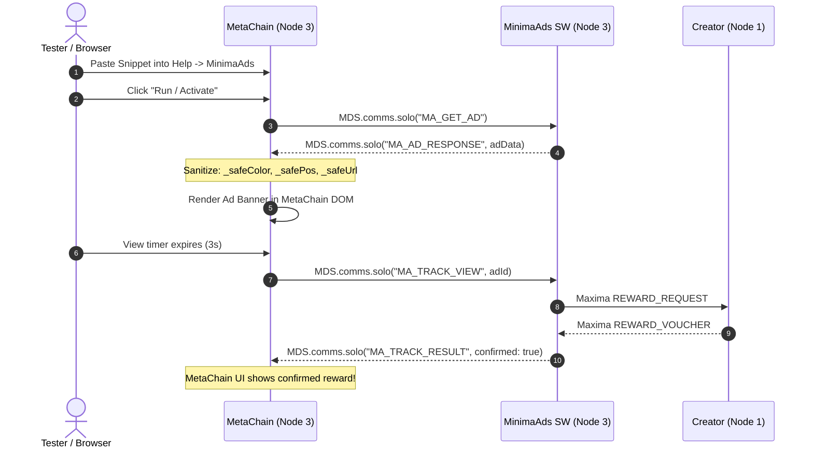

# MinimaAds: Master End-to-End Test Plan

> **Document Status**: Active Test Strategy & Master Specification  
> **Target Audience**: QA Engineers, Core Developers, Security Auditors  
> **Last Updated**: September 2026  
> **Scope**: Full system functional coverage, lifecycle state machine, third-party host integration (MetaChain snippet on Node 3), edge case resilience, and adversarial security probes.

---

## 1. Objectives & Testing Philosophy

MinimaAds is an asynchronous, multi-role decentralized application combining:
* **Consensus Layer**: On-chain KissVM contracts (Multi-output Escrow and 2-of-2 Payment Channels).
* **Network Layer**: Encrypted asynchronous P2P messaging over Maxima.
* **Background Runtime**: Rhino-based Service Worker (`service.js`) managing H2 database state and transaction building.
* **Frontend Layer**: Browser UI, ad rendering engine, and third-party publisher frame embedding.

Because actions cascade across nodes and consensus layers, testing requires a **Multi-Node Test Harness** exercising real network round-trips, cryptographic handshakes, and on-chain UTXO state transitions.

---

## 2. Test Harness Topology & Role Matrix

Testing is driven against an **N=6 node cluster** managed by [MinimaNodeManager](file:///home/joanramon/Minima/MinimaNodeManager) (`localhost:3000`) running Minima v1.0.49, with Chrome browser automation per [docs/TESTING_SETUP.md](file:///home/joanramon/Minima/MinimaAds/docs/TESTING_SETUP.md).

| Node | Dedicated Role | Primary Responsibilities & Installed DApps | Configuration / Credentials |
|:---:|:---|:---|:---|
| **Node 1** | **Campaign Creator** (Advertiser) | • Creates campaigns & funds on-chain Escrow (V3/V4)<br>• Broadcasts announcements & signs vouchers<br>• Controls campaign lifecycle (Pause, Resume, Finish)<br>• Installed: `MinimaAds` | Keypair: Default identity<br>Funds: $\ge 1500$ MINIMA |
| **Node 2** | **Native Publisher** (In-App Frame) | • Creates and hosts custom In-App Frames (`#frames`)<br>• Accumulates publisher shares<br>• Settles publisher channels via `#earnings`<br>• Installed: `MinimaAds` | Frame: Custom (`test-site-2`)<br>Funds: $\ge 50$ MINIMA |
| **Node 3** | **Third-Party Host & Viewer A** | • **Hosts MetaChain MiniDapp** running the embedded paste-and-run Snippet<br>• Built-in Viewer (`#viewer`) testing<br>• Exercises cross-dApp communication via `MDS.comms.solo`<br>• Installed: `MinimaAds` + `MetaChain` | MetaChain UID active<br>Help $\to$ MinimaAds panel<br>Funds: $\ge 50$ MINIMA |
| **Node 4** | **Platform Identity** | • MinimaAds Platform Fee recipient (6%)<br>• Owner of built-in system Frame (`builtin:<pk>`)<br>• Installed: `MinimaAds` | `MINIMAADS_PLATFORM_KEY`<br>Funds: Baseline |
| **Node 5** | **MLS Relay & Foundation** | • Minima Foundation Fee recipient (3%)<br>• Permanent Route MLS Provider (`MAX#pk#mls`)<br>• Installed: `MinimaAds` | `MINIMAADS_ALLOW_RELAY=true`<br>`maxextra action:staticmls` |
| **Node 6** | **Viewer B / Adversary** | • Secondary Viewer (concurrent impressions)<br>• Adversarial attacker node for security probes<br>• Installed: `MinimaAds` | Clean state / Attacker scripts |

---

## 3. Test Suites & Execution Procedures

### Suite A: Advertiser / Creator Setup & Escrow Funding
Verifies the campaign launch flow, financial split accuracy, and consensus state initialization.

* **Test A.1: Campaign Creation & Fee Distribution**
  * **Role / Node**: Node 1 (Advertiser)
  * **Preconditions**: Node 1 has $> 1100$ MINIMA.
  * **Steps**:
    1. Navigate to `#campaigns` $\to$ Create Campaign.
    2. Input Title: `"E2E Master Campaign"`, Total Budget: `1000 MINIMA`, Reward View: `0.1`, Reward Click: `0.2`, Duration: `7 days`.
    3. Click Submit and approve MDS transaction.
  * **Expected Results**:
    * Escrow split transaction created with 3 outputs:
      * Output 0: $30.0$ MINIMA (3%) $\to$ Foundation (Node 5).
      * Output 1: $60.0$ MINIMA (6%) $\to$ Platform (Node 4).
      * Output 2: $1000.0$ MINIMA (91%) $\to$ `ESCROW_ADDRESS`.
    * On-chain state ports $1, 2, 3, 4, 5, 6, 7, 10, 11, 12, 13, 14, 15, 16$ properly populated.
    * `STATE(7)` is `"active"`.
    * Ground truth: `MDS.cmd('coins address:' + ESCROW_ADDRESS)` returns the new unspent coin.

* **Test A.2: Announcement Propagation & Identity Pinning**
  * **Role / Node**: Node 1 $\to$ Nodes 2, 3, 6
  * **Steps**:
    1. Node 1 broadcasts `CAMPAIGN_ANNOUNCE`.
    2. Inspect Node 3 and Node 6 `#campaigns` views.
  * **Expected Results**:
    * Campaign appears as `"Active"` across all nodes within seconds.
    * Initial discovery establishes TOFU identity (`CREATOR_ADDRESS`, `ESCROW_COINID`).

* **Test A.3: Profile Info Exchange (AUD-6 Verification)**
  * **Role / Node**: Node 3 (Viewer) $\to$ Node 1 (Creator)
  * **Steps**:
    1. Node 3 requests Creator profile via `PROFILE_REQUEST`.
    2. Node 1 responds with `PROFILE_RESPONSE` carrying `publickey`, `name`, and URL-encoded avatar `icon`.
  * **Expected Results**:
    * Node 3 verifies `payload.publickey.toUpperCase() === senderPk.toUpperCase()`.
    * Creator's name and avatar render in campaign detail.

---

### Suite B: Native Viewer Flow & Accrual (In-App `#viewer`)
Verifies payment channel opening, incremental reward accrual, and on-chain settlement.

* **Test B.0: Multi-Campaign Selection Algorithm (Tags & Reputation Weighting)**
  * **Role / Node**: Node 3 (Viewer)
  * **Preconditions**: At least 2 active campaigns exist (e.g. Campaign 1 with tags `["crypto", "defi"]` and high reputation, Campaign 2 with tags `["gaming"]`).
  * **Steps**:
    1. Set Viewer interests in `#profile` or settings.
    2. Invoke `selectAd(campaigns, userTags)` via `#viewer` or SDK.
    3. Observe selected campaign.
  * **Expected Results**:
    * Priority score accurately weights tag overlap, remaining budget, and creator reputation tier (T-REP2).
    * Flagged creators receive 0 weight and are excluded from ad selection.

* **Test B.1: Channel Opening (2-of-2 Multisig)**
  * **Role / Node**: Node 3 (Viewer) $\leftrightarrow$ Node 1 (Creator)
  * **Steps**:
    1. Node 3 opens campaign detail and triggers View.
    2. Node 3 sends `CHANNEL_OPEN_REQUEST` (role: viewer, `viewer_key`, `viewer_wallet_addr`, `viewer_wallet_pk`, `max_amount=1.0`).
    3. Node 1 creates channel coin, posts split tx, and returns `CHANNEL_OPEN`.
  * **Expected Results**:
    * `CHANNEL_STATE` row on Node 3 updates to `'open'`.
    * `OPENER_MX_PK` on Node 1 is recorded as Node 3's Maxima PK (N2-4).
    * Channel coin exists on-chain at `CHANNEL_ADDRESS`.

* **Test B.2: Impression Timer & Incremental Accrual (Rule C-1)**
  * **Role / Node**: Node 3 (Viewer)
  * **Steps**:
    1. Ad renders; 3-second countdown timer runs.
    2. On timer completion: Node 3 dispatches `REWARD_REQUEST` (`cumulative=0.1`).
    3. Node 1 checks $\Delta = 0.1 \le \text{REWARD\_VIEW}$, builds and co-signs `REWARD_VOUCHER`.
    4. Node 3 receives `REWARD_VOUCHER` and updates local DB.
  * **Expected Results**:
    * Status shows: `"Reward confirmed! Received: 0.100000 MINIMA"`.
    * Zero console errors. `CUMULATIVE_EARNED` in `CHANNEL_STATE` equals `0.100000`.

* **Test B.3: Click CTA Accrual**
  * **Role / Node**: Node 3 (Viewer)
  * **Steps**:
    1. Click CTA banner.
    2. Target URL opens in new tab with sanitized scheme (`target=_blank`).
    3. Node 3 dispatches `REWARD_REQUEST` (`cumulative=0.3`, `reward_type: click`).
  * **Expected Results**:
    * Node 1 verifies $\Delta = 0.2 \le \text{REWARD\_CLICK}$, issues updated voucher.
    * Node 3 `CUMULATIVE_EARNED` updates to `0.300000`.

* **Test B.4: Channel Settlement & Monies Received**
  * **Role / Node**: Node 3 (Viewer)
  * **Steps**:
    1. Navigate to `#earnings`.
    2. Click **"Settle"** on the open channel.
    3. System runs `txnimport` $\to$ `txncheck` (requires `valid.mmrproofs=true`) $\to$ `txnsign` $\to$ `txnpost`.
  * **Expected Results**:
    * Transaction confirmed on-chain:
      * Output 0: $0.300000$ MINIMA $\to$ Viewer wallet address.
      * Output 1: $0.700000$ MINIMA $\to$ Escrow refund change.
    * Channel moves to `"Settled channels"` in UI. Balance reflects new funds.

---

### Suite C: MetaChain Snippet Integration (Node 3 Third-Party Host)
Verifies the cross-dApp embedding flow using the **MetaChain** MiniDapp installed on Node 3.



* **Test C.1: Frame Generation on Node 2**
  * **Role / Node**: Node 2 (Publisher)
  * **Steps**:
    1. In MinimaAds, navigate to `#frames`.
    2. Create Frame: Title: `"MetaChain Sidebar"`, Type: `"Display Banner"`.
    3. Click **"Get Code Snippet"** and copy generated HTML/JS.
  * **Expected Results**:
    * Generated snippet contains embedded CSS/URL sanitizers (`_safeColor`, `_safePos`, `_safeUrl`).

* **Test C.2: MetaChain Snippet Execution on Node 3**
  * **Role / Node**: Node 3 (**MetaChain MiniDapp**)
  * **Steps**:
    1. In browser, navigate to the **MetaChain MiniDapp tab** on Node 3.
    2. Open **Help $\to$ MinimaAds** panel.
    3. Paste the snippet copied from Node 2 into the paste-and-run textarea.
    4. Click **"Run"**.
  * **Expected Results**:
    * Snippet communicates with local MinimaAds SW via `MDS.comms.solo()`.
    * Event trail: `MA_GET_AD` $\to$ `MA_AD_RESPONSE` $\to$ Banner renders cleanly inside MetaChain DOM.
    * Ad styling matches advertiser parameters without style bleeding.
    * After 3 seconds: `MA_TRACK_VIEW` fires $\to$ `MA_TRACK_RESULT confirmed:true amount:0.1`.
    * MetaChain console reports zero CSP or script errors.

* **Test C.3: Publisher Payout Attribution**
  * **Role / Node**: Node 1 (Creator) $\to$ Node 2 (Publisher)
  * **Steps**:
    1. Verify Node 1 dispatches `PUBLISHER_REWARD_NOTIFY` to Node 2 for the MetaChain view.
    2. Node 2 opens publisher channel and receives publisher voucher.
    3. Node 2 navigates to `#earnings` and clicks **"Settle"**.
  * **Expected Results**:
    * Node 2 receives publisher reward percentage on-chain.

---

### Suite D: Campaign Lifecycle & State Machine

* **Test D.1: Pause & Resume Transition**
  * **Role / Node**: Node 1 (Creator) $\to$ Node 3 (Viewer)
  * **Steps**:
    1. Node 1 clicks **"Pause"** in `#mycampaigns`.
    2. Observe on-chain coin update and `CAMPAIGN_PAUSE` propagation.
    3. Node 3 attempts to view ad during pause.
    4. Node 1 clicks **"Resume"**.
  * **Expected Results**:
    * Escrow coin moves to new UTXO with `STATE(7)="paused"`.
    * While paused: Viewer receives `REWARD_REJECTED reason: paused`. Open channels remain untouched.
    * On resume: `STATE(7)="active"`. Ads resume serving.

* **Test D.2: Manual Early Finish & Auto-Settlement (OPEN-3)**
  * **Role / Node**: Node 1 (Creator) $\to$ Node 3 (Viewer)
  * **Steps**:
    1. Ensure Node 3 has an open, unsettled viewer channel.
    2. Node 1 clicks **"Close Campaign"** (Finish).
    3. Escrow coin transitions to `STATE(7)="finished"`.
    4. Node 1 broadcasts `CAMPAIGN_FINISH` with Strong Identity.
  * **Expected Results**:
    * Node 3 receives `CAMPAIGN_FINISH` with Strong Identity $\to$ triggers `applyStatusChange(..., 'finished')` with `settling: true`.
    * Node 3 automated settlement process runs in background.
    * Channel moves to `'settled'` within $< 35$ seconds with zero manual clicks required.
    * Publisher channels are **not** auto-settled (remain manual per specification).

* **Test D.3: Time / Block Expiration**
  * **Role / Node**: Node 1 / All
  * **Steps**:
    1. Mine blocks until tip height exceeds Escrow `STATE(2)` (Expiry Block).
    2. `checkExpiredCampaigns` runs on `NEWBLOCK`.
  * **Expected Results**:
    * Campaign flips to terminal `'finished'`. No new channels can be opened.

---

### Suite E: Resilience, Edge Cases & Failure Modes

* **Test E.1: Creator Offline During View Request**
  * **Role / Node**: Node 3 (Viewer) vs Node 1 (Offline)
  * **Steps**:
    1. Stop Node 1 (`kill_all_nodes.sh` or pause process).
    2. Node 3 attempts `MinimaAds.trackView()`.
  * **Expected Results**:
    * `_checkCreatorLiveness` times out (30s cache expiration).
    * Returns `{confirmed: false, reason: 'creator offline'}` cleanly without crash or infinite hang.

* **Test E.2: Stale Voucher Recovery (`VOUCHER_SYNC_REQUEST`, OPEN-2 / Fragility #58)**
  * **Role / Node**: Node 3 (Viewer) $\leftrightarrow$ Node 1 (Creator)
  * **Steps**:
    1. Simulate channel coin movement while viewer holds earlier voucher.
    2. Viewer attempts settlement $\to$ fails due to spent channel coin.
    3. Viewer dispatches `VOUCHER_SYNC_REQUEST`.
  * **Expected Results**:
    * Node 1 detects channel is in `'settling'`/`'open'` state.
    * Node 1 rebuilds voucher fresh against active on-chain channel coin.
    * Viewer receives updated voucher and successfully settles.

* **Test E.3: Channel Budget Exhaustion (`MAX_AMOUNT`)**
  * **Role / Node**: Node 3 (Viewer)
  * **Steps**:
    1. View ads repeatedly until `CUMULATIVE_EARNED == MAX_AMOUNT`.
    2. Attempt $(N+1)$-th view.
  * **Expected Results**:
    * Server rejects further accrual. Prompts channel closure/settlement.

* **Test E.4: Network Namespace Disconnection & Reconnection**
  * **Role / Node**: Node 3
  * **Steps**:
    1. Run `./scripts/disconnect_node.sh 3`.
    2. Attempt network actions $\to$ fail cleanly.
    3. Run `./scripts/reconnect_node.sh 3`.
  * **Expected Results**:
    * Node 3 rejoins network, syncs IBD/TxPoW tree, and reconciles pending channels.

---

### Suite F: Security & Adversarial Probes

* **Test F.1: Forged `CAMPAIGN_FINISH` from Non-Creator (AUD-3 / OPEN-3 Probe)**
  * **Role / Node**: Node 6 (Attacker) $\to$ Node 3 (Victim)
  * **Steps**:
    1. Node 6 crafts and sends raw Maxima packet:
       ```json
       { "type": "CAMPAIGN_FINISH", "campaign_id": "<Node 1 Campaign ID>" }
       ```
  * **Expected Results**:
    * Node 3 passes message to `_assertCreatorThen`.
    * Mismatch detected: `senderPk !== creatorPk` and `senderPk !== strongRoutePk`.
    * **Message dropped**. Local campaign remains `"active"`.
    * Negative reputation event `creator_assert_failed` logged against Node 6.

* **Test F.2: Forged `PROFILE_RESPONSE` Identity Theft (AUD-6)**
  * **Role / Node**: Node 6 (Attacker) $\to$ Node 3 (Victim)
  * **Steps**:
    1. Node 6 sends `PROFILE_RESPONSE` with `payload.publickey = <Node 1 PK>` and fake name/icon.
  * **Expected Results**:
    * Node 3 detects `payload.publickey !== senderPk`.
    * **Message dropped**. Profile cache remains unpoisoned.

* **Test F.3: Unauthorized `REWARD_REQUEST` by Third Party (N2-4)**
  * **Role / Node**: Node 6 (Attacker) $\to$ Node 1 (Creator)
  * **Steps**:
    1. Node 6 intercepts active channel ID between Node 1 and Node 3.
    2. Node 6 sends `REWARD_REQUEST` for that channel using its own Maxima key.
  * **Expected Results**:
    * Node 1 checks `senderPk !== channel.OPENER_MX_PK`.
    * **Request rejected**. Attacker cannot steal voucher or drain channel.

* **Test F.4: Escrow Dust Coin Poisoning (OPEN-4)**
  * **Role / Node**: Node 6 (Attacker) $\to$ Blockchain
  * **Steps**:
    1. Node 6 sends 0.000001 MINIMA to `ESCROW_ADDRESS` with `STATE(7)="finished"`.
  * **Expected Results**:
    * Node 3 processes coin via `processEscrowCoin`.
    * Forward-lineage check `_resolveEscrowCoinTrust` fails (coin is not genesis anchor and not a hash-derived child).
    * **Coin ignored**. Campaign remains active.

* **Test F.5: Reputation Slashing, Creator Blocking & Viewer Filtering (T-REP1, T-REP2, REP-FILTER)**
  * **Role / Node**: Node 6 (Attacker / Rogue Creator) vs. Node 3 (Viewer)
  * **Preconditions**: Node 6 has an active campaign propagated to Node 3; Node 3 is in Viewer mode.
  * **Steps**:
    1. Node 3 navigates to `#viewer` and verifies Node 6's campaign appears in the list with its initial reputation tier badge (`New` or `OK`).
    2. Node 6 executes an adversarial probe against Node 3 (e.g., F.1 forged status change or F.2 profile spoof).
    3. Node 3 Service Worker detects the violation and immediately records negative evidence (`creator_assert_failed` or `identity_pin_violation`).
    4. Verify Node 3 local database: `PEER_REPUTATION` row for Node 6 drops score and transitions to `TIER='flagged'`.
    5. In Node 3 `#viewer`:
       - Default mode: Node 6's campaign row immediately displays the prominent red `[Flagged]` badge next to the ad title.
       - Clicking the campaign opens detail view: verify the red `[Flagged]` badge is displayed in the header row alongside a `"Block Advertiser"` button.
       - Navigate to `#settings` $\to$ *Ad Preferences & Blocklist*: toggle on *"Automatically hide ads from Flagged creators"*.
       - Return to `#viewer`: verify Node 6's campaign is completely hidden from the available ad list.
       - Return to `#settings` and disable *"Automatically hide ads from Flagged creators"*.
       - Return to `#viewer`, open Node 6's campaign, click *"Block Advertiser"*, and accept the confirmation prompt.
       - Confirm Node 6 is added to the local blocklist in `MDS.keypair`:
         - Campaign is hidden from `#viewer` list.
         - Excluded from `selectAd()` pool for local frames.
         - Displayed under `#settings` $\to$ *Blocked Advertisers* with an *"Unblock"* action.
       - Click *"Unblock"* under `#settings`: confirm Node 6's campaign reappears in `#viewer` (with its red `[Flagged]` badge intact).
  * **Expected Results**:
    * Full end-to-end local reputation containment: attack detection $\to$ local tier transition $\to$ UI warning $\to$ automated & manual filtering $\to$ blocklist management.

---

## 4. Current Baseline Verification Matrix (Prior Sessions vs. Pending Scope)

The table below documents which tests have **already been verified live** during prior audit & development sessions (under Minima v1.0.45) versus the **pending edge cases and v1.0.49 regression targets**.

| Suite | Test ID | Description | Historical Status | Prior Evidence / Audit Session | Target for Next Run (v1.0.49) |
|:---:|:---:|---|:---:|---|:---:|
| **A** | **A.1** | Escrow Creation & 3-output fee split | ✅ **Verified** | `docs/E2E_LIVE_RUN_2026-09-07.md §2 (Flow 6.3)` — verified on-chain via `MDS.cmd('coins')` | Smoke check |
| **A** | **A.2** | Announcement & TOFU Identity Pinning | ✅ **Verified** | `docs/E2E_LIVE_RUN_2026-09-07.md §2 (Flow 6.10)` — propagated to Node 3 within seconds | Smoke check |
| **A** | **A.3** | Profile exchange (AUD-6) | ✅ **Verified** | `docs/HISTORY.md §17 (2026-09-11 AUD-6 / T-REP0)` — round-trip profile caching clean | Smoke check |
| **B** | **B.0** | Multi-Campaign Ad Selection Algorithm | ⬜ **Pending** | Marked ⬜ in 2026-09-07 run (only 1 active campaign existed). Needs $\ge 2$ competing campaigns | **High Priority** |
| **B** | **B.1** | Channel Open (2-of-2 multisig) | ✅ **Verified** | `docs/E2E_LIVE_RUN_2026-09-07.md §2 (Flow 6.5)` — Node 3↔Node 1 channel coin confirmed | Smoke check |
| **B** | **B.2** | 3s View countdown & voucher accrual | ✅ **Verified** | `docs/E2E_LIVE_RUN_2026-09-07.md §2 (Flow 6.1, 6.6)` — `CUMULATIVE_EARNED=0.100000` | Smoke check |
| **B** | **B.3** | Click CTA accrual | ✅ **Verified** | `docs/E2E_LIVE_RUN_2026-09-07.md §2 (Flow 6.2)` — `cumulative:0.3` | Smoke check |
| **B** | **B.4** | Manual Settlement via `#earnings` | ✅ **Verified** | `docs/E2E_LIVE_RUN_2026-09-07.md §2 (Flow 6.7)` — $0.3$ to viewer wallet, $0.7$ change to escrow | Smoke check |
| **C** | **C.1** | Custom Frame Creation (`#frames`) | ⬜ **Pending** | Built-in Frame tested; custom Frame creation flow needs dedicated pass | **Medium Priority** |
| **C** | **C.2** | MetaChain Snippet Run on Node 3 | ✅ **Verified** | `docs/HISTORY.md §17 (2026-09-06 Audit #8, #9)` — executed live in MetaChain Help panel | Smoke check |
| **C** | **C.3** | Publisher Payout & Attribution | ✅ **Verified** | `docs/HISTORY.md §17 (2026-09-06 Audit #7)` — publisher voucher accrual verified | Smoke check |
| **C** | **C.4** | Publisher Manual Settlement | ✅ **Verified** | `MinimaAds.md §4.5` & `docs/HISTORY.md §17 (2026-09-08 OPEN-3)` — manual settlement confirmed | Smoke check |
| **D** | **D.1** | Manual Pause & Resume | ✅ **Verified** | `docs/E2E_LIVE_RUN_2026-09-07.md §3 (7a, 7b)` — ground-truth coins `STATE(7)="paused"` / `"active"` | Smoke check |
| **D** | **D.2** | Early Finish & Viewer Auto-Settle | ✅ **Verified** | `docs/HISTORY.md §17 (2026-09-08 OPEN-3)` — channel auto-settled in $\sim35$s post-Finish | Smoke check |
| **D** | **D.3** | Block Height Expiry | ⬜ **Pending** | Automated expiry formula implemented (`port 2`); live block-mining test pending | **Medium Priority** |
| **E** | **E.1** | Creator Offline during trackView | ⚠️ **Partial** | `docs/HISTORY.md §17 (2026-09-08)` — partial due to relay routing (#61); timeout needs re-test | **High Priority** |
| **E** | **E.2** | Stale Voucher Recovery (OPEN-2 / #58) | ⚠️ **Code-Verified** | `docs/HISTORY.md §17 (2026-09-06 OPEN-2, Fragility #58)` — live spent-coin simulation pending | **High Priority** |
| **E** | **E.3** | Channel Capacity Exhaustion (`MAX_AMOUNT`) | ⬜ **Pending** | Needs sequential views until `CUMULATIVE == MAX_AMOUNT` | **Medium Priority** |
| **E** | **E.4** | Namespace Isolation / Reconnection | ⬜ **Pending** | Shell scripts (`disconnect_node.sh` / `reconnect_node.sh`) pending automated harness test | **Medium Priority** |
| **F** | **F.1** | Adversarial Forged Finish (AUD-3/OPEN-3)| ✅ **Verified** | `docs/HISTORY.md §17 (2026-09-10 OPEN-3 Regression Probe)` — forged Finish/Pause dropped | Regression |
| **F** | **F.2** | Adversarial Profile Spoof (AUD-6) | ✅ **Verified** | `docs/HISTORY.md §17 (2026-09-11 AUD-6 / T-REP0)` — forged response dropped on PK mismatch | Regression |
| **F** | **F.3** | Adversarial Opener Hijack (N2-4) | ⬜ **Pending** | Dedicated attacker script claiming another viewer's channel ID pending live probe | **High Priority** |
| **F** | **F.4** | Adversarial Dust Coin Injection (OPEN-4)| ✅ **Verified** | `docs/HISTORY.md §17 (2026-09-09 OPEN-4)` — forward-lineage anchor check verified live | Regression |
| **F** | **F.5** | Reputation Slashing, Creator Blocking & Viewer Filtering | ⚠️ **Code-Verified** | UI badges, local blocklist & flagged auto-hide verified; live multi-node harness test pending | **High Priority** |

---

## 5. Test Execution & Reporting Template for Future Runs

When executing a new test cycle (e.g. for Minima v1.0.49 validation), copy this template to `docs/E2E_LIVE_RUN_<DATE>.md`:

```markdown
# Live Test Run Summary: [YYYY-MM-DD]
* Harness: 6 Nodes (Minima v1.0.49), MetaChain on Node 3
* Tester / Runner: [Agent / QA]

| Suite | Test ID | Description | Baseline Status | Run Result | Evidence / Log Notes |
|:---:|:---:|---|:---:|:---:|---|
| A | A.1 | Escrow Creation & 3-output fee split | ✅ Prior | ⬜ | |
| A | A.2 | Announcement & TOFU Identity Pinning | ✅ Prior | ⬜ | |
| A | A.3 | Profile exchange (AUD-6) | ✅ Prior | ⬜ | |
| B | B.0 | Multi-Campaign Ad Selection Algorithm | ⬜ New | ⬜ | |
| B | B.1 | Channel Open (2-of-2 multisig) | ✅ Prior | ⬜ | |
| B | B.2 | 3s View countdown & voucher accrual | ✅ Prior | ⬜ | |
| B | B.3 | Click CTA accrual | ✅ Prior | ⬜ | |
| B | B.4 | Manual Settlement via #earnings | ✅ Prior | ⬜ | |
| C | C.1 | Custom Frame Creation | ⬜ New | ⬜ | |
| C | C.2 | MetaChain Snippet Run on Node 3 | ✅ Prior | ⬜ | |
| C | C.3 | Publisher Payout & Attribution | ✅ Prior | ⬜ | |
| C | C.4 | Publisher Manual Settlement | ✅ Prior | ⬜ | |
| D | D.1 | Manual Pause & Resume | ✅ Prior | ⬜ | |
| D | D.2 | Early Finish & Viewer Auto-Settle (<35s) | ✅ Prior | ⬜ | |
| D | D.3 | Block Height Expiry | ⬜ New | ⬜ | |
| E | E.1 | Creator Offline during trackView | ⚠️ Partial | ⬜ | |
| E | E.2 | Stale Voucher Recovery (OPEN-2) | ⚠️ Partial | ⬜ | |
| E | E.3 | Channel Capacity Exhaustion | ⬜ New | ⬜ | |
| E | E.4 | Namespace Isolation / Reconnection | ⬜ New | ⬜ | |
| F | F.1 | Adversarial Forged Finish (AUD-3/OPEN-3) | ✅ Prior | ⬜ | |
| F | F.2 | Adversarial Profile Spoof (AUD-6) | ✅ Prior | ⬜ | |
| F | F.3 | Adversarial Opener Hijack (N2-4) | ⬜ New | ⬜ | |
| F | F.4 | Adversarial Dust Coin Injection (OPEN-4)| ✅ Prior | ⬜ | |
| F | F.5 | Reputation Slashing, Creator Blocking & Viewer Filtering | ⚠️ Code-Verified | ⬜ | |
```

